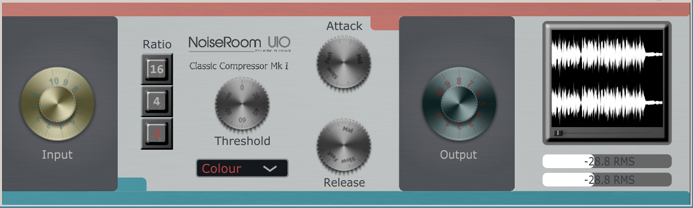

# **CCMkI** 

## Classic Compressor MkI

## Introduction

The CCMkI is a vst3/au compressor inspired in a classic compressor 1176. This plugin was build with objetive of create a good sounding limiter/compressor with an intuitive interface with the ability to saturate the input signal. The main algorithm is based in Erick Tarr basic compressor with a biquad filter and exponential saturation while the GUI kept a minimalistic style with six basic compressor's parameters (input, ratio, threshold, attack, release and output), aditionally the main interface draw the output signal in real-time and allow vizualice it in RMS bar meters. The project was presented as final project for the course Developping Plugins by Ear Candy Technologies 2024.

## Manual

### Features

- Real-Time compression.
- Input, threshold, attack, release, output configuration.
- Four prestablish presets.
- Intuitive interface.

### Parameters

- **Input:** This knob adjusts the level of the signal before any processing happens. Increasing the input level will also add distortion to the signal.
- **Ratio:** This buttons controls how much the signal will be attenuated above the chosen threshold. A ratio of 2:1 implies that the input level will be attenuated by half overt the threshold. If any button is active input saturation will be applied.
- **Threshold:** This knob adjusts the level above which the compressor starts attenuating the input signal. A threshold setted up to 0 dB will no attenuate the input signal altought input saturation will be applied.
- **Attack:** This knob sets how fast compression will be applied once the signal exceeds the threshold. The attack time is adjustable from 20 microseconds (labeled as "Fast") to 800 microseconds (labeled as "Slow") (both extremely fast).
- **Release:** This knob sets how fast the compressor will recover from the gain reduction once the signal falls below the threshold. The release time is adjustable from 50 milliseconds (labeled as "Fast") to 1.1 seconds (labeled as "Slow").
- **Output:** This knob adjust the final output level of signal leaving the compressor. This control allow compensate any gain lost due to compression.

### Presets

The CCMkI includes 4 mode presets:

**Sudaka** This mode has hard limmiting properties with slow attack ans fast release wich allows pass some transients and add extra distortion. Recomended for drums and rooms mics.
**Orangine** This mode has severe compression mid/fast time attack and release fits great with everything.
**Colour** This mode saturates the input level and applies light compression to the signal. Usefull to add harmonics to any instrument.
**Glue**  This mode has moderate compression, mainly aplied to "glue" various instruments in a mix bus.

### Multi ratio buttons

A special carracteristics is multiple ratio buttons conbinations that creates diferent ratio compressions. The combinations avaliable are:

- active ratio 2 and 4 unlock ratio of 6.
- active ratio 2 and 16 unlock ratio of 8.
- active ratio 4 and 16 unlock ratio of 20.
- active ratio 2,4 and 16 unlock ratio of 12.

### Visualizations and Metering

The VU meter displays the RMS output signal. While the black screen let visualise the output waveform. Under the display there is a slider that change the buffer to vizualice small or larger wave portions.

## Technical

### Compressor Design

### References

- (1) Tarr, E. (2018). Hack Audio: An Introduction to Computer Programming and Digital Signal Processing in MATLAB (1st ed.). Routledge.
- (2) Reiss, J.D., & McPherson, A. (2015). Audio Effects: Theory, Implementation and Application (1st ed.). CRC Press.
- (3) https://github.com/HackAudio/textbookcode
- (4) https://github.com/p-hlp/CTAGDRC
- (5) https://help.uaudio.com/hc/en-us/articles/4419447352980-UA-1176-Classic-Limiter-Collection-Manual
- (6) https://media.uaudio.com/assetlibrary/1/1/1176ln_manual.pdf
