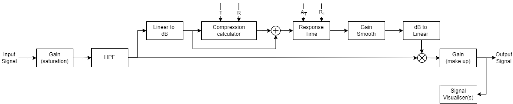
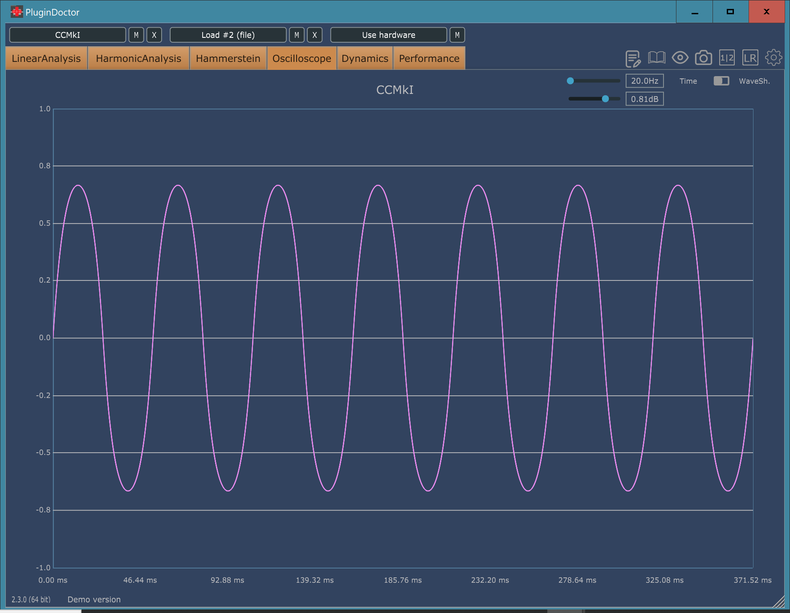
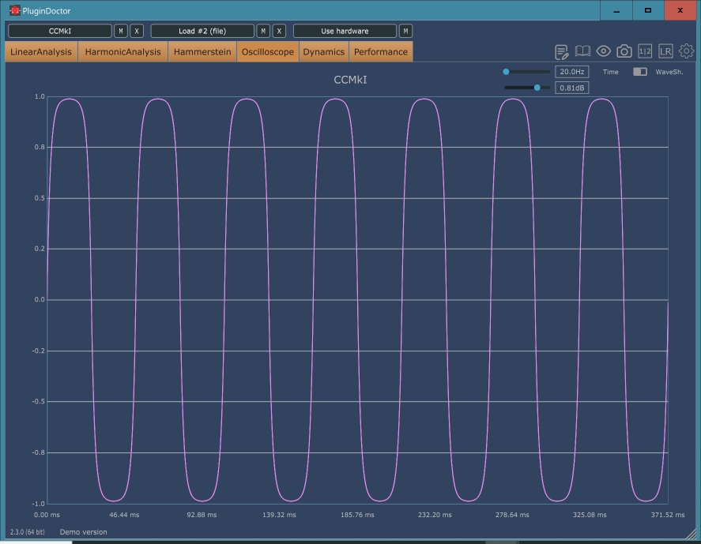
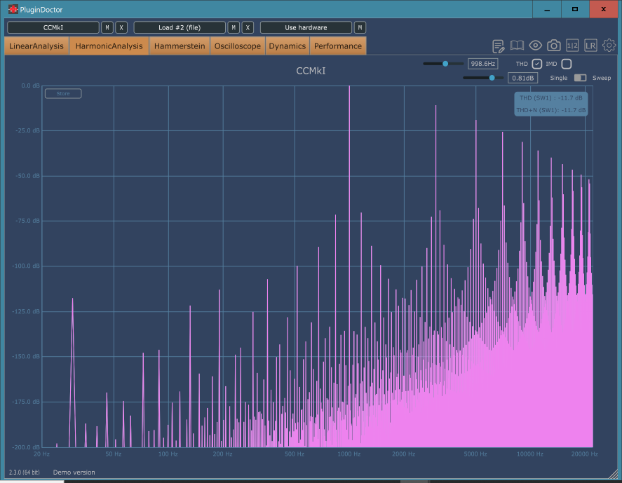
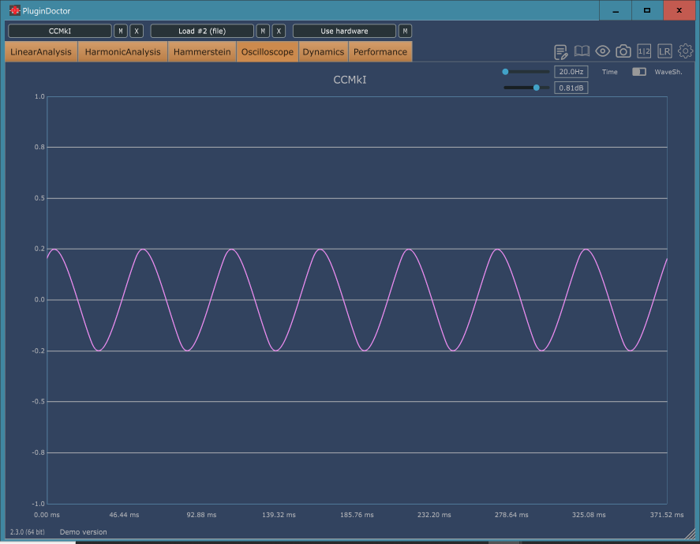
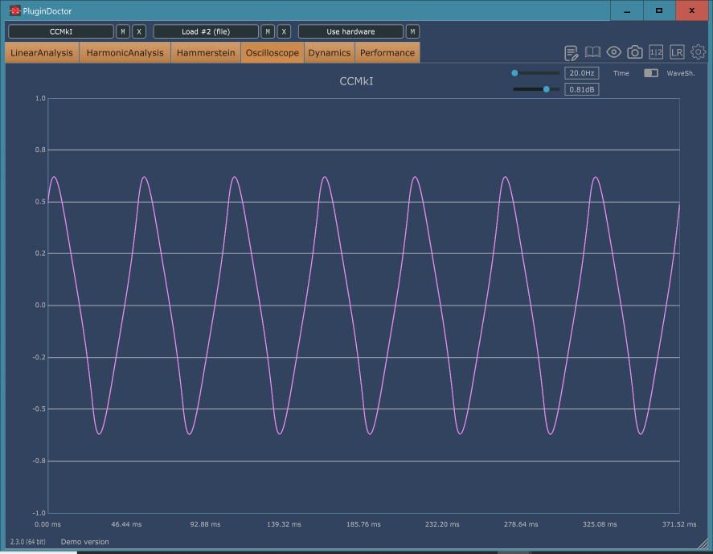
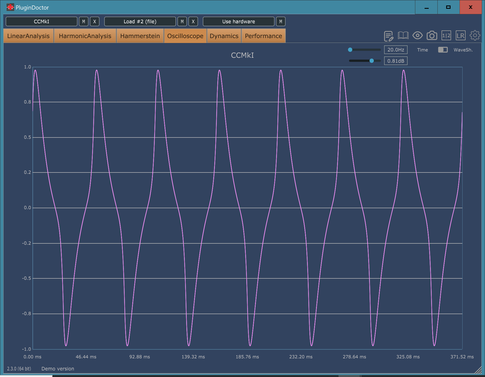
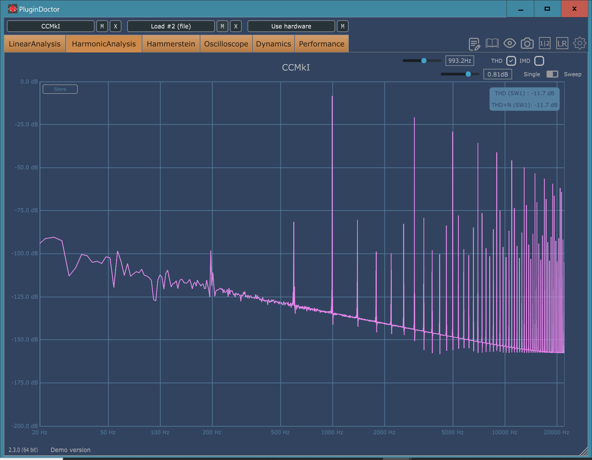

# **CCMkI**

## Classic Compressor MkI

## Content

- [**CCMkI**](#ccmki)
  - [Classic Compressor MkI](#classic-compressor-mki)
  - [Content](#content)
  - [Introduction](#introduction)
  - [Manual](#manual)
    - [Features](#features)
    - [Parameters](#parameters)
    - [Presets](#presets)
    - [MultiRatio Buttons](#multiratio-buttons)
    - [Visualizations and Metering](#visualizations-and-metering)
  - [Technical](#technical)
    - [System Architecture](#system-architecture)
      - [Block Diagram](#block-diagram)
      - [User Interface](#user-interface)
    - [Compressor Algorithm](#compressor-algorithm)
      - [Input Saturation](#input-saturation)
      - [Signal Detection](#signal-detection)
      - [Applying Threshold and Ratio](#applying-threshold-and-ratio)
      - [Attack and Release](#attack-and-release)
      - [Smoothness](#smoothness)
      - [Applying Output Gain](#applying-output-gain)
    - [Bibliography and other references](#bibliography-and-other-references)

## Introduction

The CCMkI is a vst3/au compressor inspired in a classic compressor 1176. This plugin was build with objetive of create a good sounding limiter/compressor with an intuitive interface with the ability to saturate the input signal. The main algorithm is based in Erick Tarr's basic compressor with a biquad filter and exponential saturation while the GUI kept a minimalistic style with six basic compressor's parameters (input, ratio, threshold, attack, release and output), additionally the main interface draw the output signal in real-time and allow visualise it in RMS bar meters. The project was presented as final project for the course Developing Plugins by Ear Candy Technologies 2024.

## Manual

### Features

- Real-Time compression.
- Input, threshold, attack, release, output configuration.
- Four prestablish presets.
- Intuitive interface.

### Parameters

- **Input:** This knob adjusts the level of the signal before any processing happens. Increasing the input level will also add distortion to the signal.
- **Ratio:** This buttons controls how much the signal will be attenuated above the chosen threshold. A ratio of 2:1 implies that the input level will be attenuated by half overt the threshold. If any button is active input saturation will be applied.
- **Threshold:** This knob adjusts the level above which the compressor starts attenuating the input signal. A threshold setted up to 0 dB will no attenuate the input signal although input saturation will be applied.
- **Attack:** This knob sets how fast compression will be applied once the signal exceeds the threshold. The attack time is adjustable from 20 microseconds (labelled as "Fast") to 800 microseconds (labelled as "Slow") (both extremely fast).
- **Release:** This knob sets how fast the compressor will recover from the gain reduction once the signal falls below the threshold. The release time is adjustable from 50 milliseconds (labelled as "Fast") to 1.1 seconds (labelled as "Slow").
- **Output:** This knob adjust the final output level of signal leaving the compressor. This control allow compensate any gain lost due to compression.

### Presets

The CCMkI includes 5 mode presets:

- **MyConfig** This mode allow the user modify the parameters freely. *IMPORTANT NOTE* This mode MUST be selected if you modify any parameter. If you choose any other mode and it is modify it will restore the original preset settings next time you open the user interface.
- **Sudaka** This mode has hard limiting properties with slow attack ans fast release which allows pass some transients and add extra distortion. Recommended for drums and rooms mics.
- **Orangine** This mode has severe compression mid/fast time attack and release fits great with everything.
- **Colour** This mode saturates the input level and applies light compression to the signal. Useful to add harmonics to any instrument.
- **Glue**  This mode has moderate compression, mainly applied to "glue" various instruments in a mix bus.

### MultiRatio Buttons

A special characteristics is multiple ratio buttons combinations that creates different ratio compressions. The combinations available are:

- Active ratio 2 and 4 unlock ratio of 6.
- Active ratio 2 and 16 unlock ratio of 8.
- Active ratio 4 and 16 unlock ratio of 20.
- Active ratio 2,4 and 16 unlock ratio of 12.

### Visualizations and Metering

The VU meter displays the RMS output signal. While the black screen let visualise the output waveform. Under the display there is a slider that change the buffer to visualise small or larger wave portions.

## Technical

### System Architecture

The audio signal into CCMkI is divided into several key components:

**Audio Input:** Receives the audio signal to be compressed.

**Input Gain:** Add logarithmic distortion to the input signal.

**High-Pass Filter:** To remove low frequencies that should not be compressed.

**Compression:** Measures the amplitude of the audio signal and add compression according to defined parameters.

**Output Gain/Make up:** Compensates the output signal after compression is applied.

**Audio Output:** Outputs the processed audio signal.

#### Block Diagram

#### User Interface

The user interface allows adjustment of the following parameters:

- Input Gain
- Threshold
- Ratio
- Attack
- Release
- Output Gain
- Visualiser Component

### Compressor Algorithm

#### Input Saturation

Saturation limits the signal peaks and can introduce harmonic distortion, which can give a warmer sound. The algorithm implemented for the CCMkI is based in a soft clipping equation:

$$f(x)=sgn(x)(1-e^{|Gx|})$$

This equation approaches to a clipping saturation but never reaches it. Also, the amount of distortion increases smoothly as the input signal increases. The following image shows three different states of an 20 Hz sine input signal in the CCMkI.

*The 20 Hz are used to easily visualize distortion over a signal*.

This image shows the Total Harmonic Distortion.  THD @ 1KHz.

The input saturation is not the only contributor to change the signal there is also a HPF biquad active in this stage, which will help distorting the signal. The following images shows the HPF cut off and how it interact over a 20 Hz signal.

Additionally, both the gain stage and HPF create high harmonic content which gives a particular sound character to the CCMkI.

#### Signal Detection

The first step in the compression process is detecting the amplitude of the audio signal. This is done using an envelope detector. The detector can be based on a peak detector or an RMS (Root Mean Square) detector. The following equation was implemented in the code to transform from linear to algorithmic signal detection.

$$X_{dB}[n]=20*log_{10}(|a_{lin}[n]|)$$

#### Applying Threshold and Ratio

Once the signal envelope is detected, it is compared to the threshold to determine the amount of compression to apply. The ratio defines how much the signal exceeding the threshold is reduced. The following equation use Threshold and Ratio to apply compression. It was also implemented in the main code.

$$g_{sc}[n]=T+{X_{dB}[n]-T \over R}$$

This equation represents the theoretical output amplitud, although, it does not tell how the signal should change. Therefore it is necessary apply the following equation.

$$ g_Δ[n] = g_{sc}[n] − x_{dB}[n]$$

#### Attack and Release

Attack and release times are part of the compression process and control how quickly the compressor will responds to amplitud changes into the input signal. This is implemented to achieve smoothness during the compression and avoid have hard clipping. the following math expressions will help to obtain the smoothness required:

$$α = e^{−ln(9) \over F_s*t_r}$$

Where:

* $\alpha$ Constant to calculate the step response.
* $f_s$ Sample frequency.
* $t_r$ Time response in seconds.

To implement this equation in the compressor, there must be set two equations. One for attack and one to release where the main variable will be their time responses (attack time and response time).

#### Smoothness

This one of the most important steps in the algorithm. It combines the gain reduction, attack and release times to avoid drastic gain changes. The following equation shows their used to smooth a signal.

$$Smooth[n] = ((1–\alpha) * g_Δ[n])+( \alpha * gainSmoothPrev[n-1])$$

To use it properly is necessary create two instances. One with the attack time when the input signal begins the compression and release mode when the signal will stop compressing.

#### Applying Output Gain

After reducing the signal, gain is applied to compensate for the reduction, ensuring that the output signal has an adequate level. This is implemented as simple addition in each processed sample.

### Bibliography and other references

This are the main resources used to implement the main algorithm.

- (1) Tarr, E. (2018). Hack Audio: An Introduction to Computer Programming and Digital Signal Processing in MATLAB (1st ed.). Routledge.
- (2) Reiss, J.D., & McPherson, A. (2015). Audio Effects: Theory, Implementation and Application (1st ed.). CRC Press.
- (3) <https://github.com/HackAudio/textbookcode>
- (4) <https://github.com/p-hlp/CTAGDRC>
- (5) <https://help.uaudio.com/hc/en-us/articles/4419447352980-UA-1176-Classic-Limiter-Collection-Manual>
- (6) <https://media.uaudio.com/assetlibrary/1/1/1176ln_manual.pdf>
